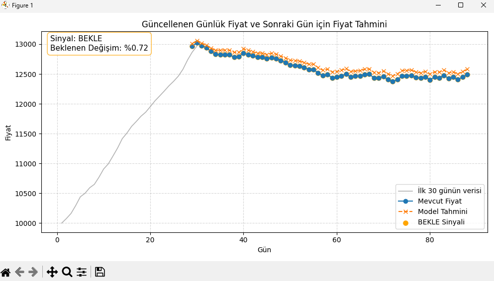

# 📈 LSTM Tabanlı Borsa Fiyat Tahmin Sistemi

Türk borsası hisse senedi fiyatlarını **LSTM (Long Short-Term Memory)** derin öğrenme modeli ile tahmin eden ve canlı simülasyon üzerinde al/sat/bekle sinyali üreten bir makine öğrenmesi projesi.

---

## 🗂️ Proje Yapısı

```
├── train_model.py       # Modeli eğiten ana script
├── live_predict.py      # Canlı simülasyon ve tahmin scripti
├── stock_data.csv       # Geçmiş borsa verileri (2021–2026, 1246 gün)
├── model.keras          # Eğitilmiş LSTM modeli
└── requirements.txt     # Bağımlılıklar
```

---

## 🧠 Model Mimarisi

Model, zaman serisi tahminine uygun çift katmanlı bir LSTM ağı kullanır:

| Katman          | Detay                              |
|-----------------|------------------------------------|
| LSTM (1. katman)| 50 birim, `return_sequences=True`  |
| Dropout         | %20 (ezber önleme)                 |
| LSTM (2. katman)| 50 birim, `return_sequences=False` |
| Dense           | 50 birim                           |
| Dense (çıkış)   | 1 birim (fiyat tahmini)            |

- **Optimizer:** Adam
- **Loss:** Mean Squared Error (MSE)
- **Metrikler:** MAE, RMSE
- **Epoch:** 200 | **Batch Size:** 32

---

## 📊 Veri Seti

- **Kaynak:** Türk borsası hisse senedi kapanış fiyatları
- **Tarih Aralığı:** Mayıs 2021 – Mayıs 2026
- **Toplam Kayıt:** 1.246 işlem günü
- **Sütunlar:** `Date`, `Open`, `High`, `Low`, `Close`, `Volume`, `Dividends`, `Stock Splits`
- **Kullanılan Özellik:** `Close` (Kapanış Fiyatı)
- **Fiyat Aralığı:** ~1.347 TL – ~15.040 TL

---

## ⚙️ Kurulum

**1. Gereksinimler**

Python 3.8+ önerilir.

```bash
pip install -r requirements.txt
```

`requirements.txt` içeriği:
```
numpy
pandas
matplotlib
scikit-learn
tensorflow
```

---

## 🚀 Kullanım

### 1. Modeli Eğitme

```bash
python train_model.py
```

- `stock_data.csv` okunur, verinin %80'i eğitim, %20'si test için ayrılır.
- **Sliding Window** yöntemiyle 30 günlük pencere kullanılarak sekanslar oluşturulur.
- Eğitim tamamlandığında model `model.keras` olarak kaydedilir.

### 2. Canlı Tahmin Simülasyonu

```bash
python live_predict.py
```

- Önceden eğitilmiş `model.keras` yüklenir.
- 10.000 TL başlangıç fiyatından başlayan 30 günlük simülasyon verisi oluşturulur.
- Her saniyede bir yeni fiyat üretilir; model bir sonraki güne ait fiyatı tahmin eder.
- Canlı güncellenen grafik ile **AL / SAT / BEKLE** sinyalleri görselleştirilir.
- `Ctrl+C` ile simülasyon durdurulabilir.

---

## 📡 Sinyal Mantığı

Modelin tahmin ettiği fiyat ile mevcut fiyat arasındaki yüzde değişime göre sinyal üretilir:

| Yüzde Değişim        | Sinyal    | Renk       |
|----------------------|-----------|------------|
| `> +%1.0`            | 🟢 **AL** | Yeşil      |
| `< -%1.0`            | 🔴 **SAT**| Kırmızı    |
| `-%1.0` ile `+%1.0`  | 🟠 **BEKLE** | Turuncu |

---

## 📉 Sliding Window Yöntemi

Model eğitiminde **30 günlük kayan pencere** kullanılır:

```
[Gün 1 – Gün 30]  → Tahmin: Gün 31
[Gün 2 – Gün 31]  → Tahmin: Gün 32
...
```

Bu sayede model, geçmiş 30 günün kapanış fiyatlarını girdi olarak alarak bir sonraki günün fiyatını tahmin eder.

---

## 🖥️ Canlı Grafik Özellikleri

Simülasyon sırasında matplotlib ile canlı güncellenen bir grafik gösterilir:

- **Gri çizgi:** İlk 30 günlük başlangıç verisi
- **Mavi çizgi:** Simülasyon sırasındaki gerçek fiyatlar
- **Kesik çizgi:** Modelin günlük tahminleri
- **▲ Yeşil nokta:** AL sinyali verilen günler
- **▼ Kırmızı nokta:** SAT sinyali verilen günler
- **● Turuncu nokta:** BEKLE sinyali verilen günler

---
## 📸 Örnek Çıktı

---

## ⚠️ Önemli Notlar

- Bu proje **eğitim amaçlıdır**; gerçek yatırım kararları için kullanılmamalıdır.
- Simülasyon verisi rastgele üretilmektedir; gerçek piyasa koşullarını yansıtmaz.
- Model performansı kullanılan hisse senedine ve veri kalitesine göre değişir.
- Daha iyi sonuçlar için epoch sayısı, pencere boyutu ve model mimarisi optimize edilebilir.

---

## 🛠️ Geliştirme Önerileri

- Çoklu hisse senedi desteği eklenebilir.
- Teknik göstergeler (RSI, MACD, Bollinger Bands) özellik olarak eklenebilir.
- Model hiperparametre optimizasyonu (Keras Tuner) uygulanabilir.
- Web arayüzü (Streamlit / Flask) ile kullanıcı dostu hale getirilebilir.
- Gerçek zamanlı borsa API'si (yfinance, Alpha Vantage) entegre edilebilir.